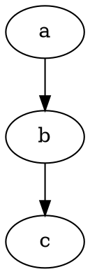
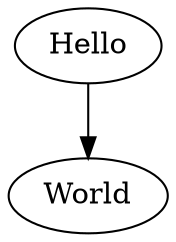
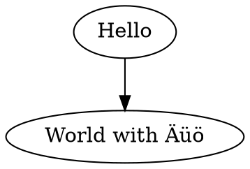

# Examples

1. Normal list
2. With stuff

## Maths

Some inline maths $RR^2$ and something more complicated $\frac{r^2}{2+1}$

The some maths on its own:

$$\frac{r^2}{2+1}$$

## Lua filter

{{helloworld}}

## Examples of Graphviz code block

### Basic usage

````text

````


### Specify layout engine

````text
```{.graphviz layout=neato}
digraph {
  a -> b;
  a -> c;
  a -> d;
  a -> e;
  a -> f;
}
```
````

```{.graphviz layout=neato}
digraph {
  a -> b;
  a -> c;
  a -> d;
  a -> e;
  a -> f;
}
```

### Error in code

<!--
```graphviz
digraph {
  a -- b;
  b -- c;
}
``` -->

## Graphviz

Use this:

```text
digraph G {Hello->World}
```

to get:



with accented characters "Äüö":



See [(this is a link to whatever)](#whatever) for an example with options `{.graphviz #whatever caption="this is the caption" width=35%}`:

```{.graphviz #whatever caption="this is the caption" width=35%}
digraph G {Hello->World}
```
