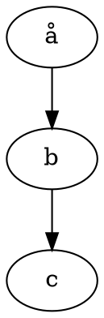

---
geometry:
- margin=1in
papersize: A4
---

# Examples

1. Normal list
2. With stuff

## Maths

Some inline maths $RR^2$ and something more complicated $\frac{r^2}{2+1}$

The some maths on its own:

$$\frac{r^2}{2+1}$$

## Examples of Graphviz code block

### Basic usage

````text

````


### Specify layout engine

````text
```{.graphviz layout=neato}
digraph {
  a -> b;
  a -> c;
  a -> d;
  a -> e;
  a -> f;
}
```
````

```{.graphviz layout=neato}
digraph {
  a -> b;
  a -> c;
  a -> d;
  a -> e;
  a -> f;
}
```

### Error in code

This will produce an error in conversion:

````text
```graphviz
digraph {
  a -- b;
  b -- c;
}
```
````

## Tables

| Id | Name | Requirements | Module | Tests |
|:--:|-----|--------------|-----|:--:|
| `r24` | Tables must look nice | Tables styled properly in the document using default style | Styling | `t1` |
| `r35` | Table smust parse | Tables using pipe markup must be parsed and displayed properly, even with inline maths $RR^2$ or block maths $$\frac{r^2}{2+1}$$ with text after it | Pandoc | `t2` |
| `r26` | Block maths mustn't break table | This table row should still display properly | Pandoc | `t3` |
