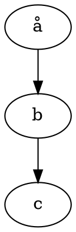

---
geometry:
- margin=1in
papersize: A4
---

# Examples

1. Normal list
2. With stuff

## Maths

Some inline maths $RR^2$ and something more complicated $\frac{r^2}{2+1}$

The some maths on its own:

$$\frac{r^2}{2+1}$$

## Examples of Graphviz code block

### Basic usage

````text

````


### Specify layout engine

````text
```{.graphviz layout=neato}
digraph {
  a -> b;
  a -> c;
  a -> d;
  a -> e;
  a -> f;
}
```
````

```{.graphviz layout=neato}
digraph {
  a -> b;
  a -> c;
  a -> d;
  a -> e;
  a -> f;
}
```

### Error in code

This will produce an error in conversion:

````text
```graphviz
digraph {
  a -- b;
  b -- c;
}
```
````

## Tables

| Name | Address |
|---|--------|
|Bob|White House|
|Alice|Rabbit Hole|
