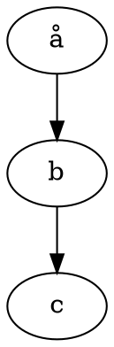

---
geometry:
- margin=1in
papersize: A4
---

# Example Markdown

## Basic Markdown

1. Normal list
2. With stuff

## Maths

Some inline maths $RR^2$ and something more complicated $\frac{r^2}{2+1}$

The some maths on its own:

$$\frac{r^2}{2+1}$$

## Graphviz

### Basic usage

````text

````


### Specify layout engine

````text
```{.graphviz layout=neato}
digraph {
  a -> b;
  a -> c;
  a -> d;
  a -> e;
  a -> f;
}
```
````

```{.graphviz layout=neato}
digraph {
  a -> b;
  a -> c;
  a -> d;
  a -> e;
  a -> f;
}
```

### Error in code

This will produce an error in conversion:

````text
```graphviz
digraph {
  a -- b;
  b -- c;
}
```
````

## Tables

| Id | Name | Requirements | Module | Tests |
|:--:|-----|--------------|-----|:--:|
| `r24` | Tables must look nice | Tables styled properly in the document using default style | Styling | `t1` |
| `r35` | Tables must parse | Tables using pipe markup must be parsed and displayed properly, even with inline maths $RR^2$ or block maths $$\frac{r^2}{2+1}$$ with text after it | Pandoc | `t2` |
| `r26` | Block maths mustn't break table | This table row should still display properly | Pandoc | `t3` |

## Highlighted code

In blocks:

```scala
val edit: Edit = new Edit{
  def apply[F[_]: Monad](implicit ops: EditOps[F]): F[Unit] = {
    import ops._
    for {
      a <- get("keyA")
      b <- get(a)
      _ <- set("keyC", b)
    } yield ()
  }
}
```

## Inline code

Inline code looks like `println("Hello")`

## Links

Links should be printed without a different "visited" colour, for better PDF export. [semver.org](https://semver.org)

## RFC8174

[RFC8174](https://tools.ietf.org/html/rfc8174) specifies a set of words to be used in specifications to unambiguously describe requirements.

The filter `--lua-filter /filters/rfc8174.lua` provides support for enhanced styling of these words.

Note that RFC8174 specifies the use of upper case to imply the special meanings of these words, and so this filter will leave lower case or mixed case words unaltered. In addition, we currently require a single space between the words of two-word phrases like "MUST NOT", otherwise only the first word will be identified as special.

When a significant word or phrase is encountered as plain text, in upper case, it is converted as follows:

1. In HTML, it becomes a span like:

   ```html
   <span class="rfc8174 rfc8174-should-not">SHOULD NOT</span>
   ```

   This always has the class `rfc8174`, and has another class `rfc8174-phrase` where `phrase` is the RFC8174 phrase, in lower case, with spaces converted to `-`.

2. In other formats, it becomes a `Strong` element containing the phrase.

This allows for a more attractive presentation, as well as adding (for example) tooltips or other formatting to RFC8174 phrases.
The default styles display these classes as follows:

1. Small caps are displayed when using a font having real small cap glpyhs, in a browser supporting `font-feature-settings: "c2sc";`
2. If the font or browser do not support small caps, normal capitals are displayed instead.
3. Absolute requirements are displayed in dark red, recommendations in blue, and options in green.
4. Emphasis is applied using a faint dashed underline

This produces the following appearance:

Requirements phrases in upper case MUST be converted to an appropriate span or Strong element.

### RFC8174 Examples

```text
1. Product MUST do something
2. Product MUST NOT do something else
3. Product SHALL do something
4. Product else SHALL NOT do something else
5. A certain feature is REQUIRED
6. Product SHOULD do this, unless there's a good reason not to
7. Product SHOULD NOT do another thing, again unless you can explain why it should (note use of "non RFC8174 should" which is not in upper case)
8. It is RECOMMENDED to do this
9. Product MAY implement a feature, but it's fine not to
10. Another feature is OPTIONAL
```

1. Product MUST do something
2. Product MUST NOT do something else
3. Product SHALL do something
4. Product else SHALL NOT do something else
5. A certain feature is REQUIRED
6. Product SHOULD do this, unless there's a good reason not to
7. Product SHOULD NOT do another thing, again unless you can explain why it should (note use of lower case "should" when we are just using plain English rather than an RFC8174 phrase)
8. It is RECOMMENDED to do this
9. Product MAY implement a feature, but it's fine not to
10. Another feature is OPTIONAL
